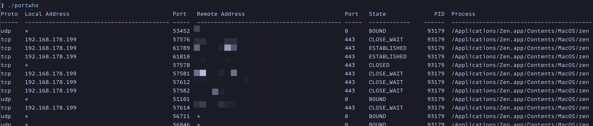

# portwho

A simple CLI written in C to list open ports on your local machine.

- supports Linux and macOS
- no external dependecies

Why?

- I always forget the arguments for `ss` and `netstat`
- A test for my local LLM setup (yes, the code was mainly written by AI, I have no experience with C and just guided the agent)
